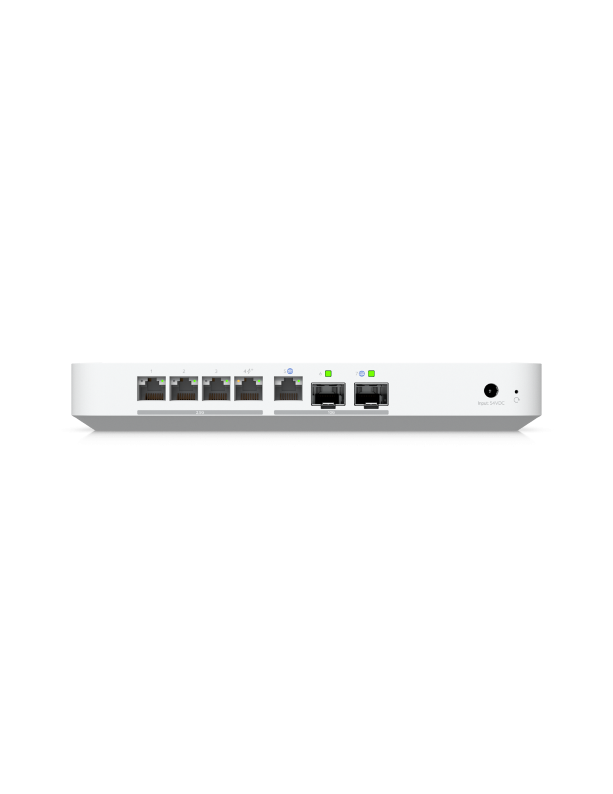

# 🧪 Advanced Network & System Engineering Lab

Ten projekt to sandbox nastawiony na symulację środowiska Enterprise. Celowo komplikuję architekturę, mieszam vendorów (Cisco, Ubiquiti, Mikrotik) i wdrażam nadmiarowe rozwiązania, aby zrozumieć, jak działają, jak się psują i jak je naprawić.

---

##  Architektura i Sprzęt (Hardware)

Obecna baza sprzętowa, która ewoluuje w kierunku klastra HA (High Availability).

| Typ | Sprzęt | Rola / Planowane użycie |
| :--- | :--- | :--- |
| **WAN/Edge** | Orange FTTH 8/1 Gbps + LEOX ONT | XGS-PON Access |
| **Gateway** | Ubiquiti UCG Fiber | IDS/IPS |
| **Core Switch** | Ubiquiti USW-Pro-HD-24 | Zarządzanie VLANami, LACP |
| **Lab Network** | Mikrotik RB5009, Cisco 1921/3560 | Router-on-a-Stick, OSPF/EIGRP, Cisco CLI |
| **Compute Node 1** | Lenovo Tiny M720q | Proxmox VE (docelowo Node w klastrze) |
| **Compute Node 2** | *Planowany zakup (SFF)* | Drugi węzeł do HA / migracji maszyn |
| **Storage** | *NAS In-progress*| iSCSI / ZFS dla klastra wirtualizacyjnego |

---

 

##  Topologia i Rola Urządzeń

<b> Schemat graficzny sieci LAN</b>

---

### 1. Production Core (Ubiquiti)

Fundament sieci zapewniający stabilność i bezpieczeństwo.
* **Gateway / UTM:** **Ubiquiti UCG Fiber**.
    * Rola: Główny router, Firewall, IDS/IPS (Intrusion Prevention System).
    * Funkcja: Kontroler sieci UniFi (SDN).

  
---
* **Distribution Switch:** **USW Pro HD 24**.
    * **Backbone:** Uplinki 10GbE SFP+
    * **Access:** Porty 2.5GbE

  
---
* **Wireless Access:** **U7 Pro XGS**.
    * **Technologia:** **WiFi 7** (802.11be) z pełną obsługą pasma 6 GHz.
    * **Interface:** Uplink **10 GbE** (eliminacja wąskiego gardła standardu 2.5 GbE).
    * **Rola:** Zapewnienie bezkompromisowej przepustowości sieci szkieletowej dla urządzeń mobilnych.
  
  
---
### 2. Lab & Training Zone (MikroTik)
Środowisko "Air-Gapped" lub wydzielone, uruchamiane do celów edukacyjnych.
* **Router:** **MikroTik RB5009 UPR**.
    * **Tryb pracy:** On-Demand (uruchamiany do testów).
    * **Zastosowanie:**
        * Nauka integracji Multi-Vendor między UniFi a MikroTik.
        * Symulacja WAN dla fizycznego labu Cisco (CCNA/CCNP).
        * Testy skryptów RouterOS i kontenerów.

  
---

## 🗺️ Mapa VLAN (Production)

| VLAN ID | Nazwa | Adresacja | Przeznaczenie |
| :--- | :--- | :--- | :--- |
| **1** | NATIVE/MGMT | x.x.x.x/24 | Untagged vlan, Infrastruktura sieciowa (Switch, AP). |
| **10** | LAB | 10.0.10.0/24 | Proxmox, Zabbix, kontenery. |
| **20** | HOME | 10.0.20.0/24 | Zaufane urządzenia (PC, Laptop). |
| **30** | IOT | 10.0.30.0/24 | Smart Home (Izolacja). |
| **99** | GUEST | 10.0.99.0/24 | Urządzenia współlokatorów i gości (Izolacja). |
---

---
 

##  Cele i Certyfikacja
 

<b>⏳ Short-term Goals: Cisco CCNA</b>

 

| Kurs / Egzamin | Opis | Status | Deadline | Badge |
| :--- | :--- | :---: | :---: | :---: |
| **1. Introduction to Networks** | *Wprowadzenie do sieci, modele OSI/TCP-IP, podstawy adresacji IP i architektury sieciowej.* | ✅ **DONE** | - |  |
| **2. Switching, Routing, & Wireless** | *Przełączanie (switching), routing, technologie bezprzewodowe (Wi-Fi) i podstawy VLAN-ów.* | 🔄 **In Progress** | **31.01** | 🔒 |
| **3. Enterprise, Security, & Automation** | *Sieci enterprise, bezpieczeństwo (firewalle, VPN), automatyzacja i programowalność (SDN).* | ⏳ **Planned** | **14.02** | 🔒 |
| **4. Egzamin CCNA 200-301** | *Pełny egzamin certyfikujący obejmujący wszystkie moduły CCNA.* |  **Cel** | **28.02** | 🏆 |

<b>🚀 Long-term Goals: Linux Professional Institute (LPIC)</b>

 

**Ścieżka administracji systemami Linux (LPIC):**

| Certyfikat | Opis | Status | Deadline | Badge |
| :--- | :--- | :---: | :---: | :---: |
| **1. LPIC 1-101** | *Fundamenty systemu Linux + sieć i storage (baza pod HA).* | ⏳ **Planned** | - | 🔒 |
| **2. LPIC-1 102** | *Usługi, bezpieczeństwo i automatyzacja podstawowa.* | ⏳ **Planned** | - | 🔒 |
| **3. LPIC-2** | *Administracja zaawansowana + zarządzanie środowiskami produkcyjnymi.* | ⏳ **Planned** | - | 🔒 |
| **4. LPIC 3-305/306** | *High Availability (HA), klastry i wirtualizacja.* | ⏳ **Planned** | - | 🔒 |
| **5. LPIC 3-303** | *Bezpieczeństwo infrastruktury i usług krytycznych.* | ⏳ **Planned** | - | 🔒 |

 

##  Roadmapa implementacji technologii w homelabie

> **Cel:** Komplikować życie, mieszać vendorów, unikać gotowców, budować od zera.

---

<b>🏆 Level 1: Networking </b>

 

*Celem jest zrozumienie, jak naprawdę działa sieć, wychodząc poza prosty router od dostawcy.*

- ✅ **Analiza potrzeb i rozplanowanie homelaba**
  - ✅ Wybór hardware
  - ✅ Podłączenie i konfiguracja sprzętu sieciowego
  - ✅ Wdrożenie **IDS/IPS**.
  - ✅ Konfiguracja RoS na mieszanym sprzęcie: Ubiquiti + MikroTik.
  - ✅ Celowe wymuszanie routingu między urządzeniami różnych producentów.

- ✅ **Segmentacja sieci (VLANs & Security Zones)**
  - ✅ Utworzenie minimum 5 VLAN-ów:
    - `GUEST` (izolowany całkowicie)
    - `IoT` (izolacja "niebezpiecznych" urządzeń)
    - `HOME INFRA` (zaufane urządzenia)
    - `CAM` (CCTV - odcięcie od Internetu)
    - `DMZ` (dla usług wystawionych na świat, np. Nextcloud)
  - ✅ **Polityki Firewall:** Blokada ruchu między VLAN-ami 
  - ✅ Konfiguracja "Zone-Based Firewall".
  - ✅ Ograniczanie przepustowości (QoS/Limiters) między VLAN-ami.
  - ✅ Implementacja STP (RSTP)

<b>🏗️ Level 2: Core Infrastructure Services (Self-Hosted)</b>

 

*Przestajemy polegać na routerze w kwestii usług. Wszystko hostujemy sami na serwerach.*

- ✅ **DHCP Server**
  - ❌ Wyniesienie DHCP z routera na dedykowany serwer (Linux/Windows Server).

- ✅ **DNS & AdBlocking**
  - ✅ **Pihole + Unbound:** Instalacja Recursive DNS Server oraz AdBlockera
  - ❌ **AdGuard Home:** Instalacja dwóch instancji (Primary/Secondary) dla High Availability.
  - ❌ **AdGuard Home Sync:** Konfiguracja synchronizacji między instancjami.
  - ❌ **DNS Rewrite:** Lokalne domeny (np. `serwer.lan`) bez wychodzenia do publicznego DNS.
  -✅ **SNMP** Wykorzystanie protokołu SNMP z użyciem Zabbix w kontenerze LXC.
  -✅ **Syslog** Loggowanie ruchu z użyciem zdalnego serwera.

- ❌ **Zarządzanie hasłami**
  - ❌ **Vaultwarden (Bitwarden):** Wdrożenie wersji Self-hosted.

- ❌ **Reverse Proxy**
  - ❌ Nauka narzędzi: **Nginx Proxy Manager**, **Traefik** lub **Caddy**.
  - ❌ Cel: Wystawienie usług pod własną domeną (np. `bitwarden.mojadomena.pl`).

- ❌ **Certyfikaty SSL (PKI)**
  - ❌ Let's Encrypt (automatyzacja).
  - ❌ **Hard Mode (LPIC-303):** Własne CA (Certificate Authority), generowanie kluczy, instalacja Root CA na urządzeniach końcowych.

<b>☁️ Level 3: Virtualization & Storage (Home Data Center)</b>

 

*Budowa wydajnego klastra obliczeniowego i walka z wydajnością I/O.*

- ⚠️ **Hypervisory**
  - ✅ **Proxmox VE:** Podstawa
  - ❌ **XCP-ng + Xen Orchestra:** Alternatywa Open Source.
  - ✅ **VMware ESXi:** (Opcjonalnie, dla znajomości standardu legacy).

- ❌ **High Availability (HA) Cluster**
  - ❌ Minimum 2-3 węzły (PC/SFF, Intel/AMD).
  - ❌ Symulacja awarii: Fizyczne odłączenie węzła ("pull the plug") i test migracji maszyn.

- ❌ **Storage & NAS**
  - ❌ Systemy: **TrueNAS Scale** lub **OpenMediaVault**.
  - ❌ **ZFS:** Zrozumienie pooli, datasetów, snapshotów, ZIL/SLOG.
  - ❌ Protokóły: iSCSI vs NFS dla wirtualizacji.
  - ❌ **Stress Test:** Symulacja pracy 100 użytkowników (generowanie obciążenia I/O).

- ✅ **Networking w wirtualizacji**
  - ✅ **Agregacja łączy:** LACP (L2) vs SMB Multichannel (L7).
  - ✅ Rozwiązywanie problemów z wąskim gardłem sieciowym dla maszyn wirtualnych.

- [ ] **Konteneryzacja**
  - ✅ **LXC:** Lekkie kontenery systemowe (Proxmox).
  - ❌ **Docker & Portainer:** Zarządzanie mikroserwisami.

<b>🔐 Level 4: Secure Remote Access & VPN</b>

 

*Dostęp do domu z każdego miejsca na ziemi, ale bezpiecznie.*

- ✅ **VPN Tradycyjny**
  - ✅ OpenVPN
  - ✅ WireGuard

- ✅ **Mesh VPN (SD-WAN)**
  - ✅ **Tailscale / Netbird:** Omijanie braku publicznego IP (CGNAT).

- ⚠️ **Tunele**
  - ✅ **Cloudflare Tunnel:** Bez otwierania portów na routerze.
  - ❌ **Pangolin:** Alternatywa Self-hosted dla Cloudflare.

<b>🌍 Level 5: VPS & "Exit to Cloud"</b>

 

*Wychodzimy z Home Labu na serwery publiczne. Nauka prawdziwego świata.*

- ⚠️ **Infrastruktura na VPS**
  - ✅ Wynajem VPS (OVH, Hetzner, Oracle).
  - ❌ **Netbird (Self-hosted):** Własny kontroler sieci Mesh na VPS.
  - ❌ **Nextcloud na VPS:** Odciążenie łącza domowego.
  - ❌ **Mail Server (Hard Mode):** Postawienie poczty od zera (Postfix, Dovecot, SPF, DKIM, DMARC)

- ⚠️ **Hardening VPS (Security)**
  - ✅ SSH: Zmiana portów, klucze RSA/Ed25519, brak haseł.
  - ❌ **CrowdSec:** Nowoczesny IPS/IDS (analiza behawioralna).
  - ❌ **Wazuh:** SIEM - zbieranie i analiza logów bezpieczeństwa.
  - ✅ **Fail2Ban** Zabezpiezczenie przed atakami bruteforce.

<b>🆔 Level 6: Identity Management (SSO) & Enterprise</b>

 

*Jeden login by wszystkimi rządzić.*

- ❌ **Identity Provider (IdP)**
  - ❌ **Authentik** lub **Keycloak**.
  - ❌ Integracja usług (Proxmox, Portainer, Wiki) przez **OAuth2 / OIDC**.

- ✅ **Active Directory**
  - ✅ Postawienie Windows Server DC.
  - ✅ Integracja usług Linuxowych z AD (LDAP/Kerberos).

- ✅ **MFA / 2FA**
  - ✅ Wymuszenie 2FA wszędzie.
  - ✅ Implementacja kluczy sprzętowych (YubiKey) lub Passkeys.

<b>🤖 Level 7: DevOps, Automation & IaC (The Endgame)</b>

 

*Koniec z "klikaniem". Wszystko jako kod.*

- ❌ **Ansible (Configuration Management)**
  - ❌ Automatyzacja konfiguracji serwerów (aktualizacje, pakiety).
  - ❌ Tworzenie Playbooków zastępujących ręczną konfigurację.

- ❌ **Terraform (Provisioning)**
  - ❌ Powoływanie maszyn na Proxmoxie/VPS kodem.

- ⚠️ **Git & CI/CD**
  - ❌ **Gitea:** Własne repozytorium kodu.
  - ✅ **Jenkins / GitHub Actions:** Potoki wdrażania (Pipeline).
  - ❌ Scenariusz: *Zmiana w kodzie -> Terraform stawia VM -> Ansible konfiguruje -> Testy.*

- ❌ **Low-Code Automation**
  - ❌ **n8n:** Automatyzacja powiadomień i przepływów pracy.

 

---
*Dokumentacja aktualizowana na bieżąco w miarę postępów w nauce.*
