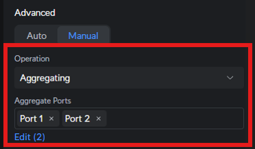
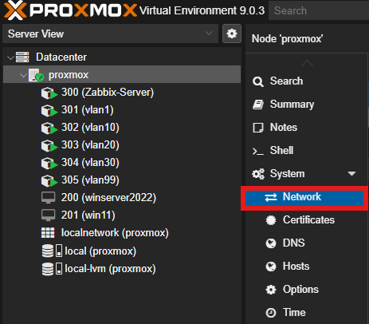
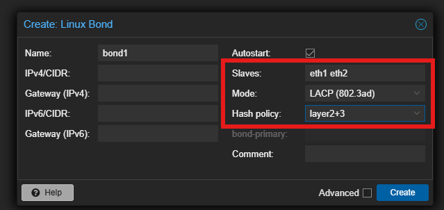
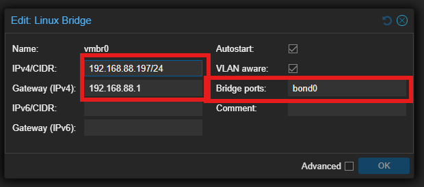

#  Level 1: Networking 

Pełna dokumentacja warstwy sieciowej, topologii fizycznej oraz logicznej (VLAN).

---

>#  Topologia Fizyczna i Sprzęt

 

### Wykaz Sprzętu (Hardware)

| Typ | Sprzęt | Rola / Planowane użycie |
| :--- | :--- | :--- |
| **WAN/Edge** | Orange FTTH 8/1 Gbps + LEOX ONT | XGS-PON Access |
| **Gateway** | Ubiquiti UCG Fiber | IDS/IPS, Routing główny |
| **Core Switch** | Ubiquiti USW-Pro-HD-24 | Zarządzanie VLANami, LACP, PoE++ |
| **Lab Network** | Mikrotik RB5009, Cisco 1921/3560 | Router-on-a-Stick, OSPF/EIGRP, Cisco CLI |
| **Compute Node** | Lenovo Tiny M720q | Proxmox VE |

---
 
 

>#  Topologia Logiczna i Opis Ról

### Schemat LAN

### 1. Production Core (Ubiquiti)
Fundament sieci zapewniający stabilność i bezpieczeństwo.

* **Gateway:** **Ubiquiti UCG Fiber**
    * Rola: Firewall, IDS/IPS, Kontroler SDN.
    * 

* **Distribution Switch:** **USW Pro HD 24**
    * Backbone: 10GbE SFP+, Access: 2.5GbE.
    * 

* **Wireless:** **U7 Pro XGS (WiFi 7)**
    * Uplink 10 GbE, obsługa pasma 6 GHz.
    * 

### 2. Lab & Training Zone (MikroTik)
Środowisko wydzielone ("Air-Gapped" logicznie) do celów edukacyjnych.

* **Router:** **MikroTik RB5009 UPR**
    * Nauka integracji Multi-Vendor.
    * Symulacja WAN dla fizycznego labu Cisco.
    * 

---

>#  Mapa VLAN (Production)

| VLAN ID | Nazwa | Adresacja | Przeznaczenie |
| :--- | :--- | :--- | :--- |
| **1** | NATIVE/MGMT | x.x.x.x/24 | Infrastruktura sieciowa (Switch, AP). |
| **10** | LAB | 10.0.10.0/24 | Proxmox, Zabbix, kontenery. |
| **20** | HOME | 10.0.20.0/24 | Zaufane urządzenia (PC, Laptop). |
| **30** | IOT | 10.0.30.0/24 | Smart Home (Izolacja). |
| **99** | GUEST | 10.0.99.0/24 | Izolowany ruch gościnny. |

># 🔗 Link Aggregation (LACP 802.3ad)

##  Cel wdrożenia
Agregacja dwóch fizycznych interfejsów 2.5GbE/2.5GbE w jeden kanał logiczny.
* **Bandwidth:** Teoretyczne podwojenie przepustowości dla wielu klientów jednocześnie.
* **Redundancy:** Odporność na awarię jednego kabla lub portu.

##  Konfiguracja (Side A: Switch)
* **Urządzenie:** USW Pro HD 24 .
* **Porty:** 1 + 2.
* **Operation Mode:** Aggregate (LACP).

##  Konfiguracja (Side B: Proxmox Server)

###  Konfiguracja GUI (Krok po kroku)

Poniższa procedura tworzy logiczny interfejs LACP (`bond0`) i przepina na niego ruch z głównego mostka sieciowego.

#### Krok 1: Utworzenie Bonda (Linux Bond)
a) Przejdź do: **Datacenter > [Twój Node] > System > Network**.
   

b) Kliknij **Create** ➝ **Linux Bond**.

#### Krok 2: Parametry Połączenia
W nowym oknie wypełnij formularz zgodnie z poniższą tabelą. To kluczowy moment konfiguracji.

| Pole | Wartość | Opis |
| :--- | :--- | :--- |
| **Name** | `bond1` | Nazwa interfejsu logicznego. |
| **Slaves** | `eth1 eth2` | Nazwy fizycznych portów (sprawdź swoje nazwy!). |
| **Mode** | `LACP (802.3ad)` | Wymaga włączonego LACP na switchu. |
| **Hash Policy** | `layer2+3` | Zapewnia lepszy rozkład ruchu (balansowanie IP+MAC). |

> 💡 **Wskazówka:** Upewnij się, że pole *IPv4/IPv6* jest puste (ustawione na `No address`). Adres IP będzie przypisany do mostka (Bridge), a nie do Bonda.

---

---

#### Krok 3: Aktualizacja Mostka (vmbr0)
Teraz musimy "przepiąć" bridge z pojedynczego kabla na nowy, bond1.

1. Znajdź na liście interfejs **`vmbr0`** i kliknij **Edit**.
2. W polu **Bridge ports** usuń stary port (np. `eno1` lub `eth1`) i wpisz nazwę bonda:
   `bond1`
3. Upewnij się, że opcja **VLAN aware** jest zaznaczona (jeśli używasz VLAN-ów).
4. Kliknij **OK**.

---

####  Krok 4: Wdrożenie (Apply Configuration)

W tym momencie zmiany są tylko "zaplanowane" (widoczne na niebiesko).

>  **UWAGA: Ryzyko utraty połączenia!**
> Przed kliknięciem *Apply Configuration* upewnij się, że **Switch UniFi** ma już skonfigurowane porty w trybie **Aggregate**. Jeśli Switch nie oczekuje LACP, a Proxmox go wymusi – stracisz dostęp do serwera.

Kliknij przycisk **Apply Configuration** na górnym pasku.

[⬅️ Powrót do strony głównej](../../README.md)