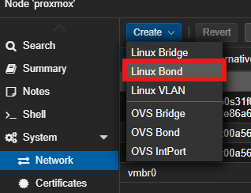

># 🔗 Link Aggregation (LACP 802.3ad)

##  Cel wdrożenia
Agregacja dwóch fizycznych interfejsów 2.5GbE/2.5GbE w jeden kanał logiczny.
* **Bandwidth:** Teoretyczne podwojenie przepustowości dla wielu klientów jednocześnie.
* **Redundancy:** Odporność na awarię jednego kabla lub portu.

##  Konfiguracja (Side A: Switch)
* **Urządzenie:** USW Pro HD 24 .
* **Porty:** 1 + 2.
* **Operation Mode:** Aggregate (LACP).

##  Konfiguracja (Side B: Proxmox Server)

###  Konfiguracja GUI (Krok po kroku)

Poniższa procedura tworzy logiczny interfejs LACP (`bond0`) i przepina na niego ruch z głównego mostka sieciowego.

#### Krok 1: Utworzenie Bonda (Linux Bond)
a) Przejdź do: **Datacenter > [Twój Node] > System > Network**.
   

b) Kliknij **Create** ➝ **Linux Bond**.

#### Krok 2: Parametry Połączenia
W nowym oknie wypełnij formularz zgodnie z poniższą tabelą. To kluczowy moment konfiguracji.

| Pole | Wartość | Opis |
| :--- | :--- | :--- |
| **Name** | `bond1` | Nazwa interfejsu logicznego. |
| **Slaves** | `eth1 eth2` | Nazwy fizycznych portów (sprawdź swoje nazwy!). |
| **Mode** | `LACP (802.3ad)` | Wymaga włączonego LACP na switchu. |
| **Hash Policy** | `layer2+3` | Zapewnia lepszy rozkład ruchu (balansowanie IP+MAC). |

> 💡 **Wskazówka:** Upewnij się, że pole *IPv4/IPv6* jest puste (ustawione na `No address`). Adres IP będzie przypisany do mostka (Bridge), a nie do Bonda.

---

---

#### Krok 3: Aktualizacja Mostka (vmbr0)
Teraz musimy "przepiąć" bridge z pojedynczego kabla na nowy, bond1.

1. Znajdź na liście interfejs **`vmbr0`** i kliknij **Edit**.
2. W polu **Bridge ports** usuń stary port (np. `eno1` lub `eth1`) i wpisz nazwę bonda:
   `bond1`
3. Upewnij się, że opcja **VLAN aware** jest zaznaczona (jeśli używasz VLAN-ów).
4. Kliknij **OK**.

---

####  Krok 4: Wdrożenie (Apply Configuration)

W tym momencie zmiany są tylko "zaplanowane" (widoczne na niebiesko).

>  **UWAGA: Ryzyko utraty połączenia!**
> Przed kliknięciem *Apply Configuration* upewnij się, że **Switch UniFi** ma już skonfigurowane porty w trybie **Aggregate**. Jeśli Switch nie oczekuje LACP, a Proxmox go wymusi – stracisz dostęp do serwera.

Kliknij przycisk **Apply Configuration** na górnym pasku.