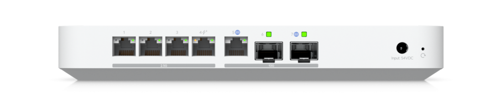
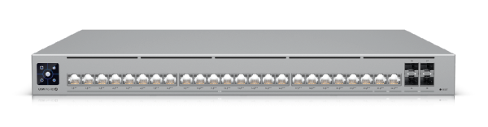
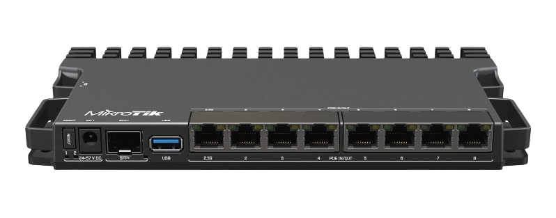

# Networking 

Pełna dokumentacja warstwy sieciowej, topologii fizycznej oraz logicznej (VLAN).

---

>#  Topologia Fizyczna i Sprzęt

 

---

##  Hardware Stack (21U Rack)

Sercem infrastruktury jest szafa rakowa 21U integrująca urządzenia różnych vendorów.

| Warstwa | Urządzenie | Rola / Opis |
| :--- | :--- | :--- |
| **WAN / Edge** | **Leox ONT** (Custom FW) | Zmodyfikowany terminal optyczny (bypass urządzenia operatora). |
| **Routing** | **Ubiquiti UCG Fiber** | Główny router / UTM (Gateway). |
| **Switching** | **UniFi USW Pro 24 PoE** | Core Switch, L3 Switching. |
| **Wireless** | **UniFi U7 Pro XGS** | Access Point Wi-Fi 7 (6GHz support). |
| **Access** | **UniFi Flex 2.5 Mini** | Dystrybucja 2.5GbE dla stacji roboczych. |
| **Compute** | **Lenovo Tiny 720Q** | Proxmox Node (Virtualization Host). |
| **Lab** | **MikroTik RB5009** | Zaawansowany routing, PoE in/out, konteneryzacja. |
---
 
 

>#  Topologia Logiczna i Opis Ról

### Schemat LAN

### 1. Production Core (Ubiquiti)
Fundament sieci zapewniający stabilność i bezpieczeństwo.

* **Gateway:** **Ubiquiti UCG Fiber**
    * Rola: Firewall, IDS/IPS, Kontroler SDN.
  
     

* **Distribution Switch:** **USW Pro HD 24**
    * Backbone: 10GbE SFP+, Access: 2.5GbE.

    

* **Wireless:** **U7 Pro XGS (WiFi 7)**
    * Uplink 10 GbE, obsługa pasma 6 GHz.
    
    

### 2. Lab & Training Zone (MikroTik)
Środowisko wydzielone ("Air-Gapped" logicznie) do celów edukacyjnych.

* **Router:** **MikroTik RB5009 UPR**
    * Nauka integracji Multi-Vendor.
    * Symulacja WAN dla fizycznego labu Cisco.
    
    

---