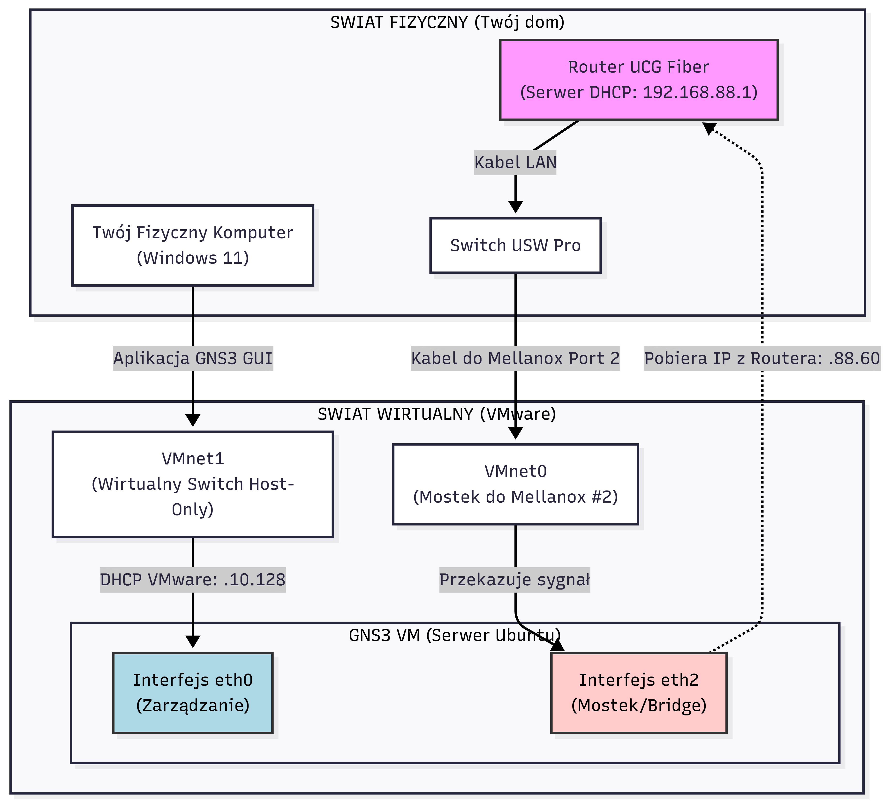
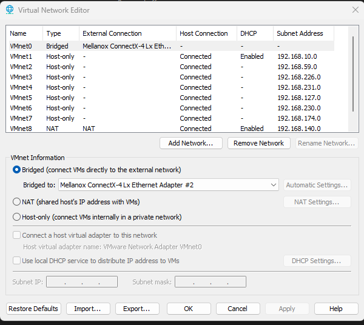
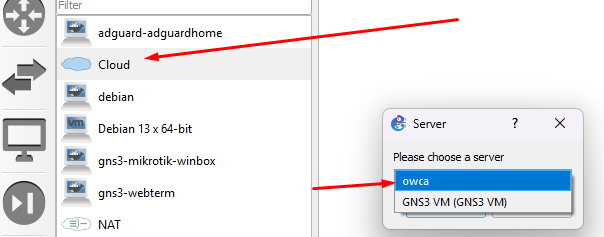
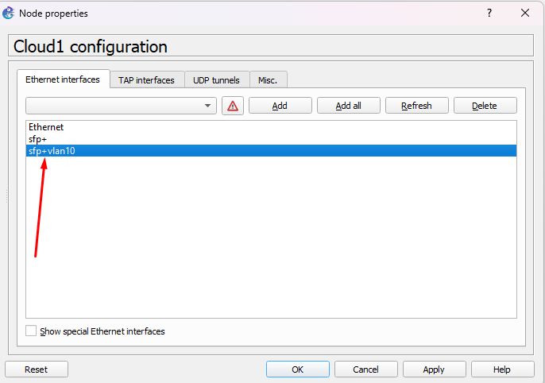
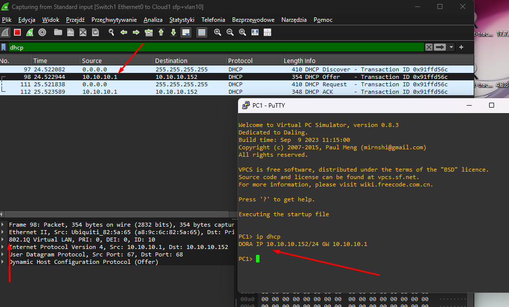

# 🟦 VMware Workstation Pro & GNS3

Hypervisor typu 2 (Desktop) używany jako backend dla symulatora sieci GNS3. Pozwala na uruchamianie cięższych obrazów (Cisco IOS-XR, Nexus, Windows Server) wewnątrz topologii sieciowej.

## 🛠️ Instalacja i Opis
VMware Workstation Pro jest obecnie **darmowy do użytku osobistego** (wymagane konto Broadcom). Działa jako "silnik" dla GNS3 VM, zapewniając lepszą wydajność niż VirtualBox dzięki wsparciu dla KVM (Nested Virtualization).

## 🗺️ Topologia Sieci (Physical & Logical Flow)
Poniższy schemat obrazuje sposób podłączenia GNS3 VM do fizycznej sieci domowej z wykorzystaniem dedykowanego interfejsu (SFP2).

## 🌐 Integracja z GNS3 (Setup)

### 1. Przygotowanie VMware
* Zainstaluj VMware Workstation Pro.
* W `Virtual Network Editor` zresetuj ustawienia do domyślnych, a następnie skonfiguruj **Bridging** (szczegóły w sekcji Sieć poniżej).

### 2. GNS3 VM (Import)
1. Pobierz **GNS3 VM.ova** ze strony gns3.com (wersja musi się zgadzać z wersją klienta GNS3!).
2. Zaimportuj plik OVA do VMware.
3. **Kluczowe ustawienie wydajności:** Edytuj maszynę -> `Processors`:
    * Zaznacz: `Virtualize Intel VT-x/EPT or AMD-V/RVI`.
    * To pozwala na zagnieżdżoną wirtualizację (KVM wewnątrz VM), co jest niezbędne dla szybkości obrazów QEMU.

### 3. Połączenie z GUI
1. Włącz GNS3 (aplikację desktopową).
2. Uruchomi się kreator "Setup Wizard" (lub wejdź w Preferences -> GNS3 VM).
3. Wybierz: **Run appliances in a virtual machine**.
4. Virtualization software: **VMware Workstation**.
5. GNS3 sam wykryje i uruchomi maszynę w tle.

## 🔌 Konfiguracja Sieciowa (Advanced Setup)

### 🎯 Cel i Kontekst (Problem vs Rozwiązanie)
Podczas integrowania GNS3 z fizyczną siecią napotkaliśmy dwa główne wyzwania:

1.  **VLAN Stripping (Wycinanie Tagów):** Sterowniki kart sieciowych w Windows (i wirtualne mostki) często usuwają tagi VLAN (802.1Q) z pakietów przychodzących. W efekcie GNS3 widzi cały ruch jako untagged (Native), uniemożliwiając zabawę z VLAN-ami.
2.  **Routing Chaos & Pętle:** Podłączenie drugiego kabla do tej samej sieci LAN powoduje, że Windows otrzymuje dwie bramy domyślne. Skutkuje to problemami z Internetem (asymetryczny routing) oraz ryzykiem pętli L2.

✅ **Rozwiązanie: "Stealth Mode & Bridge"**
Zastosowaliśmy fizyczną separację. Drugi kabel działa jako dedykowana, "przezroczysta rura" wyłącznie dla GNS3. Jest ona niewidoczna dla Windowsa (wyłączone IP), ale dostępna dla maszyny wirtualnej GNS3 jako Trunk.

---

### A. Konfiguracja Fizyczna (Dual Cable)
Wykorzystujemy dwa porty karty Mellanox ConnectX-4 Lx:

* **Port 1 (Mellanox - "Dom"):**
    * **Rola:** Główny Internet, Multimedia, Gry.
    * **Switch:** Native VLAN 1.
    * **System:** Obsługiwany normalnie przez Windows.
* **Port 2 (Mellanox - "Lab"):**
    * **Rola:** Dedykowany uplink dla symulatora GNS3.
    * **Switch:** Skonfigurowany jako **Trunk** (Native VLAN 1 + Allowed All). Dzięki temu możemy przesyłać zarówno ruch nietagowany, jak i tagowany (VLAN 20, 30 itd.).

### B. Konfiguracja "Stealth Mode" w Windows
Aby uniknąć konfliktów, musimy "ukryć" drugi port przed systemem operacyjnym hosta.

1.  Otwórz: Panel Sterowania -> Połączenia Sieciowe.
2.  Kliknij Prawym na kartę **Mellanox Port #2**.
3.  Wybierz **Właściwości**.
4.  **ODZNACZ** opcję: `Protokół internetowy w wersji 4 (TCP/IPv4)`.

> 💡 **Co to daje?**
> Windows ignoruje tę kartę – nie pobiera adresu IP, nie tworzy tras routingu i nie "miesza" w Internecie. Jednak sterownik (VMware/Npcap) nadal ma do niej dostęp sprzętowy i może przekazywać pakiety do GNS3.

---

### C. Ustawienia Virtual Network Editor (VMware)
Musimy stworzyć most (Bridge), który połączy wirtualny interfejs GNS3 VM bezpośrednio z fizycznym portem "Lab".

**Kroki:**
1.  Otwórz `Virtual Network Editor` w VMware Workstation.
2.  Dodaj nową sieć (np. VMnet0 lub VMnet2), jeśli nie istnieje.

3.  Skonfiguruj mostkowanie:
    * **VMnet1 (Host-only):** Zostaw bez zmian (Zarządzanie GUI <-> VM).
    * **VMnet0 (Bridged):**
        * Zmień ustawienie na **Bridged to:**.
        * Z listy wybierz **konkretnie** drugi port karty: **Mellanox ConnectX-4 Lx #2**.
    
    

---

## ☁️ Integracja Cloud Node (Most do świata fizycznego)

Ostatnim krokiem jest wpięcie tej fizycznej "rury" do topologii wewnątrz GNS3.

### 📝 Konfiguracja w GNS3

#### 1. Dodanie i wybór serwera Cloud
* Przeciągnij węzeł **Cloud** na pole robocze.
* **Wybór serwera:** Wybierz **GNS3 VM**.
    * *Dlaczego?* Ponieważ to na maszynie wirtualnej skonfigurowaliśmy mostek (VMnet0) do fizycznej karty. Chmura użyje interfejsu Linuxa, który jest zmostkowany z kablem.

#### 2. Mapowanie Interfejsu
* Kliknij prawym na Cloud -> **Configure**.
* Przejdź do zakładki **Ethernet Interfaces**.
* Zaznacz "Show special Ethernet interfaces".
* Wybierz interfejs odpowiadający mostkowi (zazwyczaj **eth2**; u nas nazwany np. **sfp+10** lub podobnie).
* Kliknij **Add**.

> 

#### 3. Podłączenie w topologii
* Połącz port chmury z wirtualnym switchem lub routerem.
* **Efekt:** Twoje wirtualne urządzenia mają teraz bezpośredni, fizyczny styk ze switchem USW Pro.

---

### 🔍 Weryfikacja i Analiza (Wireshark)

Celem było uzyskanie działającego DHCP oraz widoczności tagów VLAN.

#### ❌ Sytuacja "PRZED" (Problem)
Przy standardowej konfiguracji pakiety wracały bez tagów (VLAN Stripping) lub Windows odrzucał ruch DHCP. Wireshark pokazywał same zapytania bez odpowiedzi.

#### ✅ Sytuacja "PO" (Rozwiązanie)
Po zastosowaniu separacji fizycznej i mostkowania, ramki wracają poprawnie z sieci. Widzimy pełną komunikację DHCP, a co najważniejsze – **zachowane tagowanie 802.1Q** (np. VLAN 10).

